# 电影数据分析与预处理

## 数据集分析

数据集`movies.csv`记录了1916~2016年美国电影信息，包含23个属性

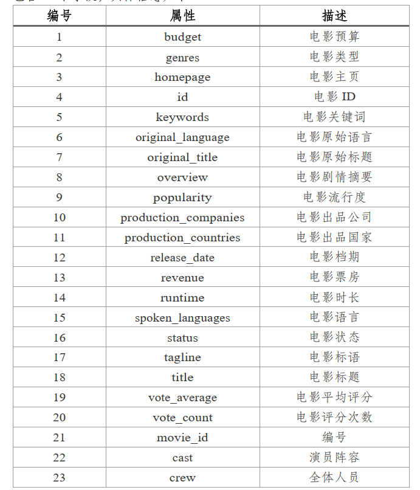

## 实验要求

### 数据基本处理

1. **删除无关属性**

   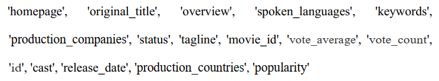对应列的序号为2、3、4、6、7、8、9、10、11、14、15、16、18、19、20、21，只保留 列0、1、5、12、13、17、22

2. **填充缺失值**

   填充`budget`、`revenue`、`runtime`、`genres`属性的缺失值 或者 为“0”的记录。可以使用专门针对IMDB的爬虫开源代码 或者 Python API获取（IMDbPY、cinemagoer等）

   - budget、revenue < 1000的也需要重新获取数据，这会影响profit_level的计算

3. **增加分类标签属性`profit_level`**

   $profit\_ration = \frac{(revenue-budget)}{budget}$

   根据profit\_ration的值 设置`profit_level`：

   - profit\_ration≥1 => 3
   - 1>profit\_ration≥0.5 => 2
   - 其余 => 1

   数据集中不能保留`profit_ratio`属性

4. **处理genres字段（电影类型）**

   按照json格式处理字段，提取name值，每个字段的表示形式为：

   Action|Adventure|Fantasy|Science Fiction  

5. **在处理后的genres属性基础上，添加新的属性**

   就是说，将genres字段的所有不同的name作为特征添加到csv文件中。每个元组genres字段对应的新属性列的值设置为1，否则为0

   4、5两步在做同一个事情：提取genres字段中的name值，将这些name值作为新属性添加到csv文件中

6. **解析crew字段并获取导演名字，新增属性`director`**

   按照json格式提取crew（工作人员）字段中 "job" == "Director"的name，即导演的名字，然后添加新属性`director`，格式为：

   “director“： Byron Howard|Nathan Greno 

7. **新增属性`total_directed`**

   添加 “拍摄这部电影的导演 执导电影总数” 属性，这需要统计csv文件中每个导演出现的次数。如果某部电影的导演多于1个人，则取这些导演执导总数的平均值

8. **删除director、 genres、 crew、 revenue、 title**

   看来这些都是帮助获得`profit_level`、`genres.name`、`total_directed`这些新属性的辅助属性

9. **列出当前所有属性**

   最终的属性为

   `budget`、`original_language`、`runtime`、`profit_level`、`genres.names`、`total_directed`

   - 字符型：`original_language`
   - 数值型：`budget`、`runtime`、`profit_level`、`total_directed`
   - 布尔型：只有0/1，`genres.names`

### 降维与聚类分析

1. **编码和标准化**

   将字符串类型的特征进行编码；对数值型属性进行标准化处理

   回答属性`original_language`的编码方式和理由

   `original_language`属性共有30多种值，其中值为`en`的样本共有4505个，样本总共有4804个，值为`en`的样本占总体的93.7%

   - 如果使用One-Hot编码，则数据会变得高维且稀疏，PCA处理的是连续数值数据，将难以捕捉数据的结构
   - 由于无序，所以不考虑Label、Ordinal

   **频数编码**

   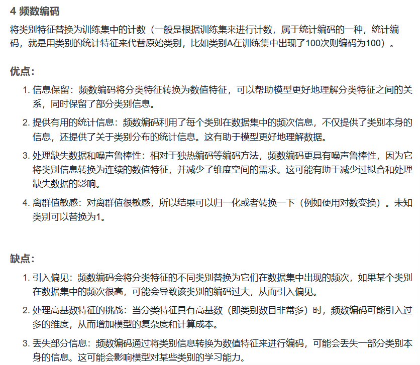

   可能会引入偏见：如果频率编码后的 `en` 值特别高，它可能会主导主成分，从而影响其他类别的投影。这意味着在降维后，`en` 类别可能会变得非常集中，导致其他类别的分布受到影响，特别是它们的方差可能被忽略。

   **目标编码**

   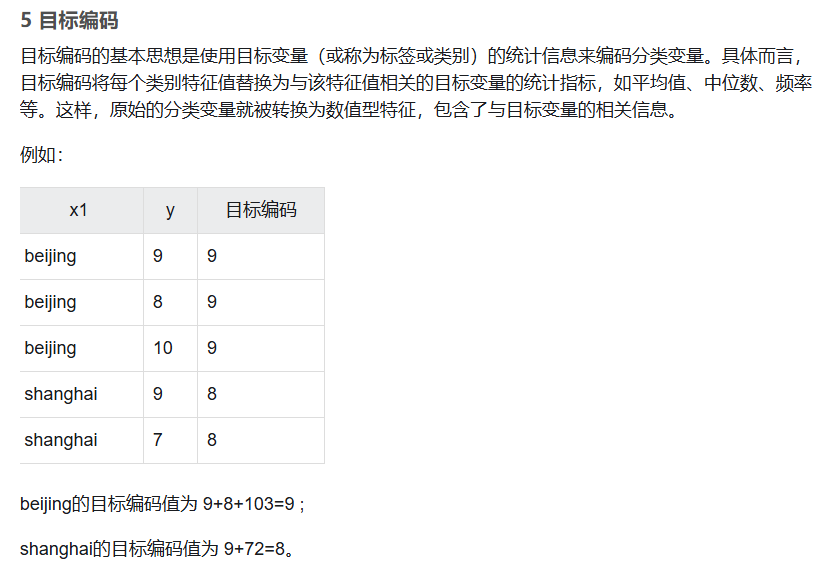

   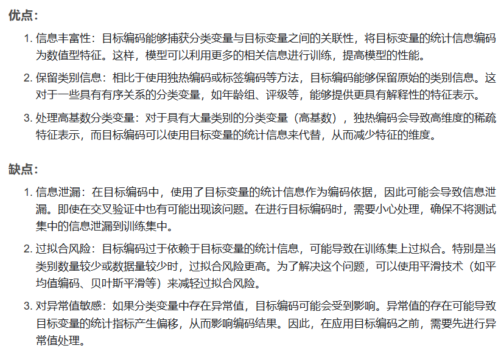

   目标变量profit_level 与 original_language有一定的关系，目标编码通过使用目标变量的统计信息来编码类别数据，能够保留类别与目标变量之间的关系，这对某些机器学习模型（如线性回归、树模型等）是非常有帮助的。除此之外，目标编码生成的是数值型数据，能有效降低稀疏矩阵的出现。然而，由于目标编码基于目标变量的统计信息，它可能会导致模型过拟合，尤其是在类别数较多且数据量较小的情况下，因此需要考虑平滑操作

   使用`CategoryEncoders`的`TargetEncoder`类，在目标编码的同时使用平滑处理，平滑处理的细节：

   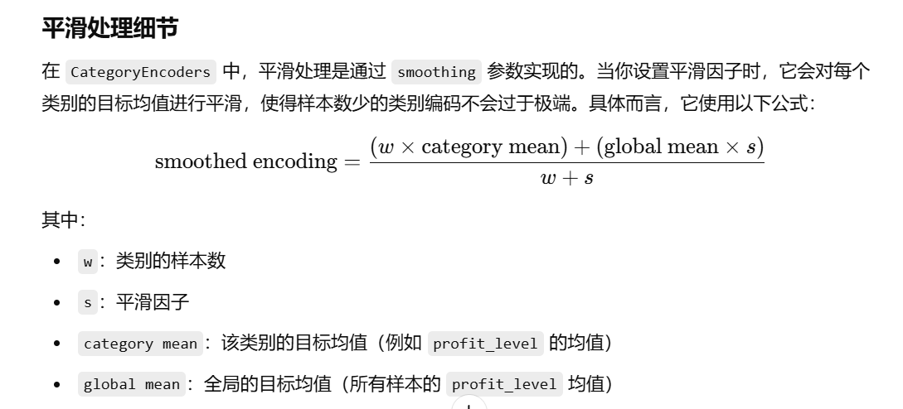

2. **降维 + 可视化**

   对于 除`profit_level`外的所有属性 分别用**PCA**和**Isomap**算法降到2维空间，绘制散点图

3. **聚类 + 可视化**

   对上一步生成的二维数据集 选择合适的聚类算法进行聚类（K可以为3），并将聚类结果可视化

4. **统计各类中`profit_level`属性值的分布**

   统计不同聚类内部电影的`profit_level`属性值的分布，以直方图显示

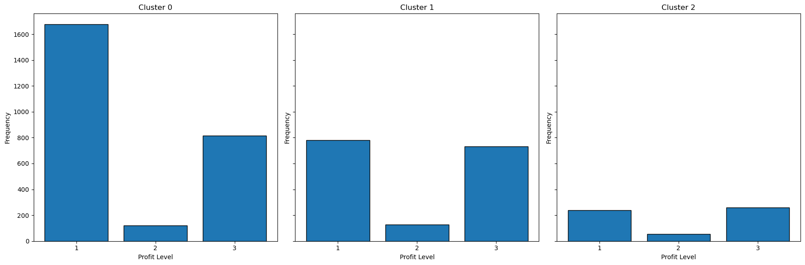

### 结果

PCA降维结果：

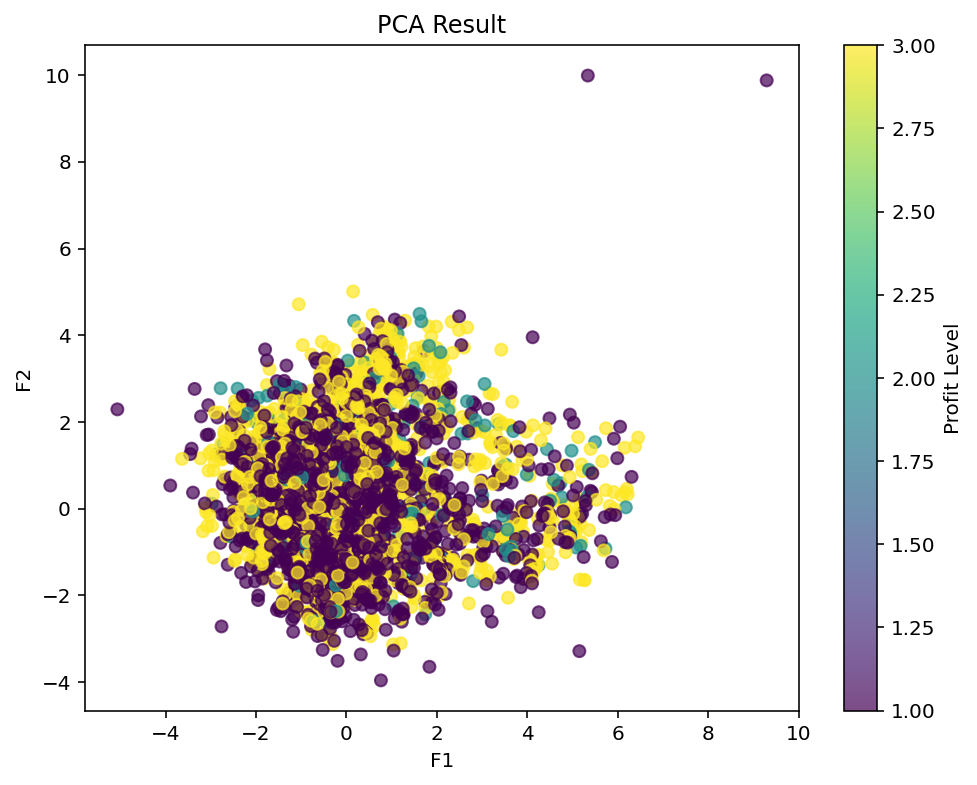

PCA+KMeans聚类结果：

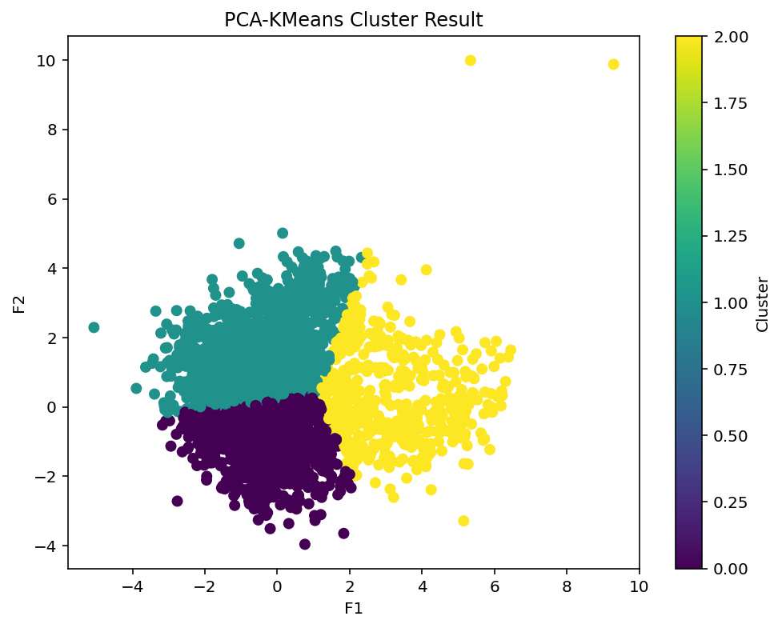

PCA+KMeans，profile-level在各个类中的分布情况：

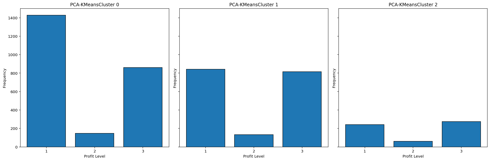

Isomap降维结果：

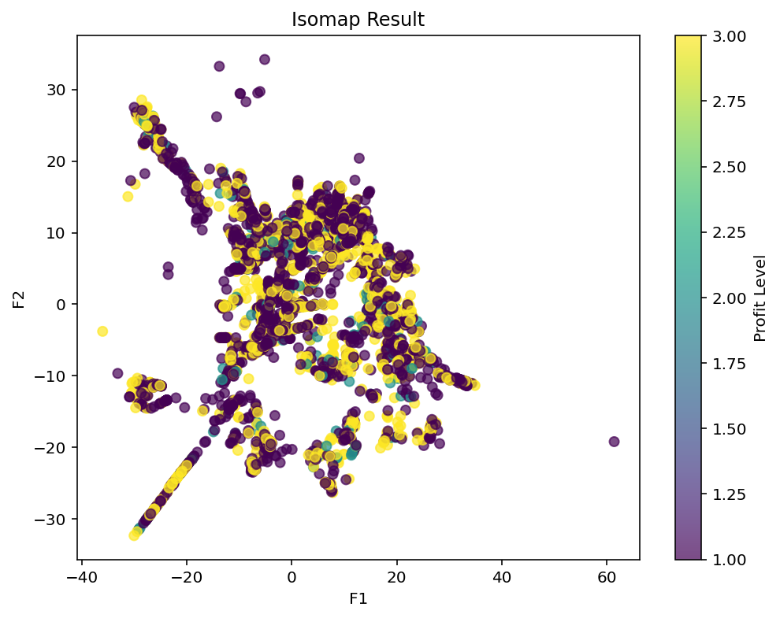

Isomap+KMeans聚类结果：

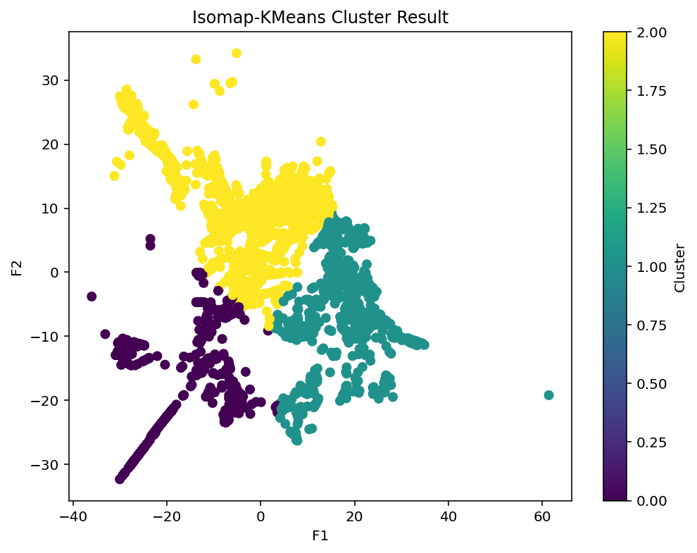

Isomap+KMeans，profit-level在各个类的分布情况

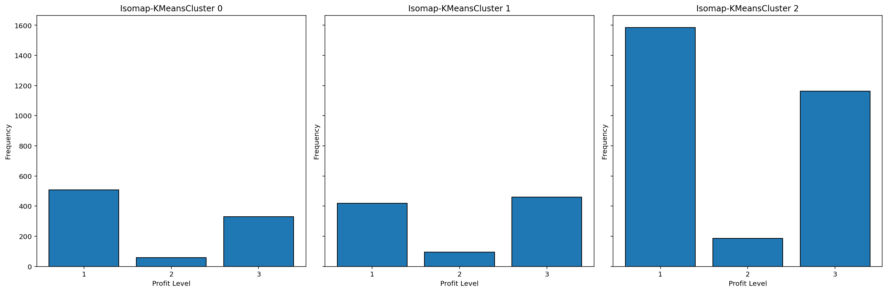

