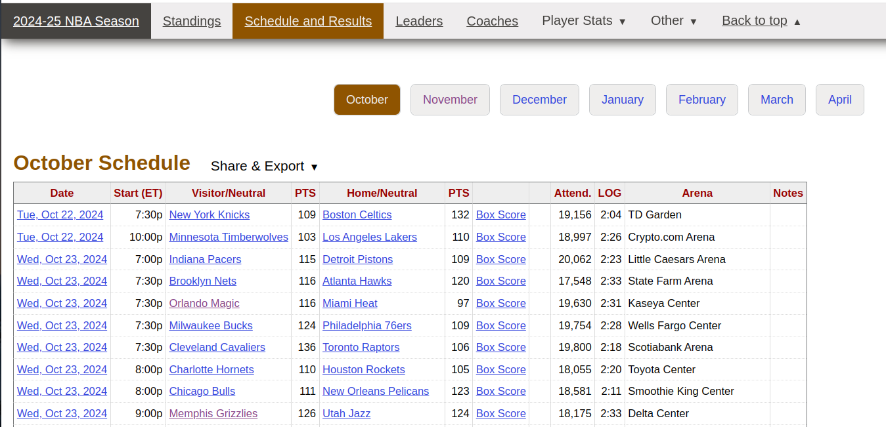
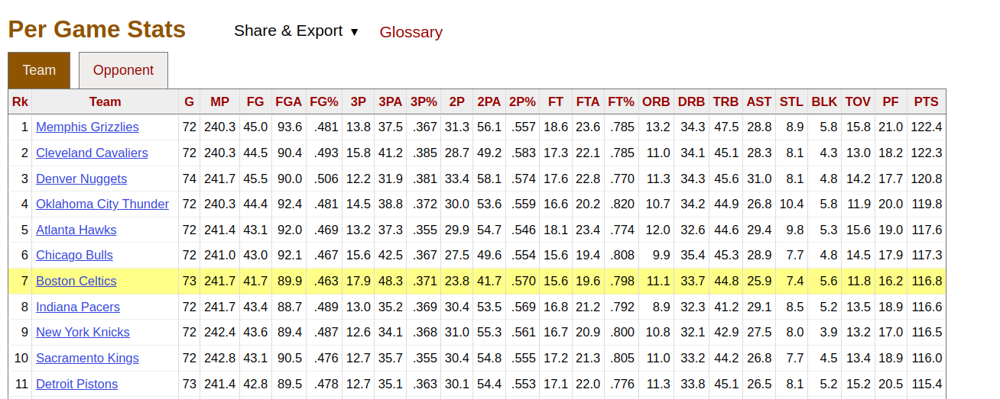
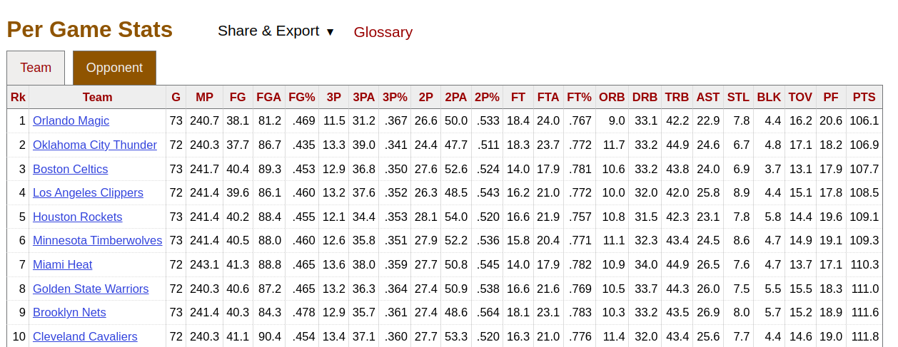
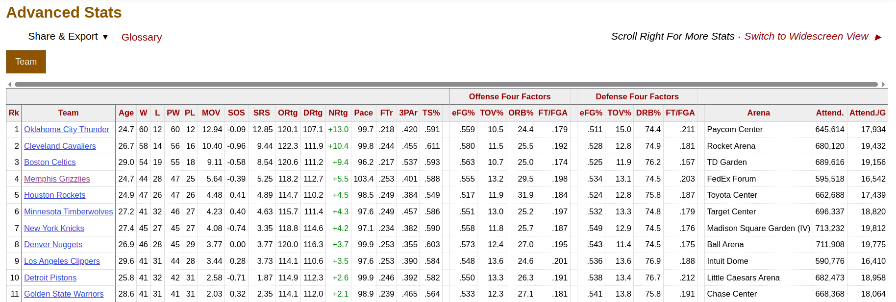
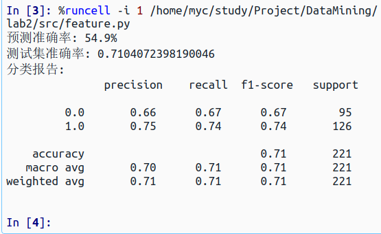

# NBA当前赛季比赛结果胜负预测

## 训练数据获取

训练数据获取：详细介绍数据源、获取方法、数据的初步处理

## 数据介绍

https://www.basketball-reference.com/leagues/，这是一个赛季整体信息的数据集

https://www.nba.com/stats/players/bio?PerMode=Totals&Season=2023-24&dir=D，这是NBA球员的身体参数

https://www.basketball-reference.com/leagues/NBA_2024_games.html，这是一个赛季每场比赛的具体信息

应该使用近三年的数据来训练模型，注意数据要配套

### Schedule and Results

注意到赛季数据有好几个月，这些数据都要用到

属性的含义：

|     **属性名**      |             **属性含义**             |
| :-----------------: | :----------------------------------: |
|      **Date**       |             **比赛日期**             |
|     Start (ET)      |       比赛开始时间（美东时间）       |
| **Visitor/Neutral** |     客队名称（或中立场地的球队）     |
|  **PTS (Visitor)**  |               客队得分               |
|  **Home/Neutral**   |     主队名称（或中立场地的球队）     |
|   **PTS (Home)**    |               主队得分               |
|      Box Score      |      比赛数据统计详情（超链接）      |
|       Attend.       |               观众人数               |
|         LOG         | 比赛时长（可能是加时次数或比赛耗时） |
|        Arena        |             比赛场馆名称             |

### Team Per Game Satas

球队场均数据，代表某支球队在整个赛季中的平均比赛数据

### Opponent Per Game Satas

球队对手在与该球队对阵的平均比赛数据，代表了对手在面对某支球队时的表现，是该球队对手的平均统计数据

属性的含义：

|               **属性名**                |                         **属性含义**                         |
| :-------------------------------------: | :----------------------------------------------------------: |
|                Rk (Rank)                |                  排名，表示数据的排序位置。                  |
|                  Team                   |                  球队名称，表示球队的名字。                  |
|                G (Games)                |                场次，表示球员参加的比赛场次。                |
|           MP (Minutes Played)           |    上场时间，表示球员在比赛中总共上场的时间，单位为分钟。    |
|          FG (Field Goals Made)          |           投篮命中数，表示球员成功投中的投篮次数。           |
|       FGA (Field Goals Attempted)       |              投篮尝试数，表示球员投篮的总次数。              |
|       FG% (Field Goal Percentage)       |   投篮命中率，表示球员投篮的命中率，计算公式为 FG / FGA。    |
|    3P (Three-Point Field Goals Made)    |         三分球命中数，表示球员成功投中的三分球数量。         |
| 3PA (Three-Point Field Goals Attempted) |           三分球尝试数，表示球员投三分球的总次数。           |
| 3P% (Three-Point Field Goal Percentage) | 三分球命中率，表示球员三分球的命中率，计算公式为 3P / 3PA。  |
|     2P (Two-Point Field Goals Made)     |         两分球命中数，表示球员成功投中的两分球数量。         |
|  2PA (Two-Point Field Goals Attempted)  |           两分球尝试数，表示球员投两分球的总次数。           |
|  2P% (Two-Point Field Goal Percentage)  | 两分球命中率，表示球员两分球的命中率，计算公式为 2P / 2PA。  |
|          FT (Free Throws Made)          |           罚球命中数，表示球员成功罚中的罚球数量。           |
|       FTA (Free Throws Attempted)       |              罚球尝试数，表示球员罚球的总次数。              |
|       FT% (Free Throw Percentage)       |   罚球命中率，表示球员罚球的命中率，计算公式为 FT / FTA。    |
|        ORB (Offensive Rebounds)         |           进攻篮板，表示球员在进攻端抢到的篮板数。           |
|        DRB (Defensive Rebounds)         |           防守篮板，表示球员在防守端抢到的篮板数。           |
|          TRB (Total Rebounds)           | 总篮板，表示球员在一场比赛中抢到的总篮板数，计算公式为 ORB + DRB。 |
|              AST (Assists)              |      助攻，表示球员的助攻数，即传球帮助队友得分的次数。      |
|              STL (Steals)               |  抢断，表示球员的抢断数，即球员从对方球员手中偷得球的次数。  |
|              BLK (Blocks)               |        盖帽，表示球员的盖帽数，即阻挡对方投篮的次数。        |
|             TOV (Turnovers)             |                失误，表示球员丧失球权的次数。                |
|           PF (Personal Fouls)           |         个人犯规，表示球员在比赛中被判定的犯规次数。         |
|            **PTS (Points)**             |             得分，表示球员在比赛中得到的总得分。             |

### Advanced Satas

综合统计数据

这包含了以下属性：

|                        属性名                        |                           属性含义                           |
| :--------------------------------------------------: | :----------------------------------------------------------: |
|                      Rk (Rank)                       |                             排名                             |
|                         Age                          |                        队员的平均年龄                        |
|                     **W (Wins)**                     |                           胜利次数                           |
|                    **L (Losses)**                    |                           失败次数                           |
|              **PW (Pythagorean wins)**               |               基于毕达哥拉斯理论计算的赢的概率               |
|             **PL (Pythagorean losses)**              |               基于毕达哥拉斯理论计算的输的概率               |
|               MOV (Margin of Victory)                |                      赢球次数的平均间隔                      |
|              SOS (Strength of Schedule)              | 用以评判对手选择与其球队或是其他球队的难易程度对比，0为平均线，可以为正负数 |
|              SRS (Simple Rating System)              |                              3                               |
|               ORtg (Offensive Rating)                |                 每100个比赛回合中的进攻比例                  |
|               DRtg (Defensive Rating)                |                 每100个比赛回合中的防守比例                  |
|                  Pace (Pace Factor)                  |                每48分钟内大概会进行多少个回合                |
|            FTr (Free Throw Attempt Rate)             |                  罚球次数所占投射次数的比例                  |
|             3PAr (3-Point Attempt Rate)              |                  三分球投射占投射次数的比例                  |
|            TS% (True Shooting Percentage)            |               二分球、三分球和罚球的总共命中率               |
|        eFG% (Effective Field Goal Percentage)        |             有效的投射百分比（含二分球、三分球）             |
|              TOV% (Turnover Percentage)              |                   每100场比赛中失误的比例                    |
|         ORB% (Offensive Rebound Percentage)          |               球队中平均每个人的进攻篮板的比例               |
|                        FT/FGA                        |                      罚球所占投射的比例                      |
|   eFG% (Opponent Effective Field Goal Percentage)    |                       对手投射命中比例                       |
|         TOV% (Opponent Turnover Percentage)          |                        对手的失误比例                        |
|         DRB% (Defensive Rebound Percentage)          |                球队平均每个球员的防守篮板比例                |
| FT/FGA (Opponent Free Throws Per Field Goal Attempt) |                对手的罚球次数占投射次数的比例                |

### Bios Stats

从https://stats.nba.com/stats中获得球员生物信息的统计数据，由于网页使用ajax请求，数据被包含在一个极大的json文件中，可以使用爬虫爬取该数据并转换为csv文件

属性名和属性含义：

|          属性           |                           属性含义                           |
| :---------------------: | :----------------------------------------------------------: |
|       `PLAYER_ID`       |              球员唯一标识符（数据库中的唯一ID）              |
|      `PLAYER_NAME`      |                           球员全名                           |
|        `TEAM_ID`        |                        球队唯一标识符                        |
| **`TEAM_ABBREVIATION`** |                 **球队缩写（如 LAL=湖人）**                  |
|        **`AGE`**        |            **球员年龄（以赛季开始时的年龄为准）**            |
|   **`PLAYER_HEIGHT`**   |              **身高（英尺-英寸格式，如 6'9"）**              |
| `PLAYER_HEIGHT_INCHES`  |             身高总英寸数（如 81 英寸≈206 厘米）              |
|   **`PLAYER_WEIGHT`**   |              **体重（磅，如 250 磅≈113 公斤）**              |
|        `COLLEGE`        |               大学经历（未读大学则为 `None`）                |
|        `COUNTRY`        |                             国籍                             |
|      `DRAFT_YEAR`       |                 选秀年份（未参加选秀则为空）                 |
|      `DRAFT_ROUND`      |             选秀轮次（如 1=首轮，未选秀则为空）              |
|     `DRAFT_NUMBER`      |           选秀顺位（如 1=状元，次轮第30顺位为30）            |
|          `GP`           |                   出场次数（Games Played）                   |
|          `PTS`          |                 场均得分（Points Per Game）                  |
|          `REB`          |      场均篮板数（Rebounds Per Game，含进攻和防守篮板）       |
|          `AST`          |                场均助攻数（Assists Per Game）                |
|      `NET_RATING`       |           净效率值（球员在场时每百回合球队净胜分）           |
|       `OREB_PCT`        |    进攻篮板率（球员在场时球队进攻篮板由该球员获得的比例）    |
|       `DREB_PCT`        |    防守篮板率（球员在场时球队防守篮板由该球员获得的比例）    |
|        `USG_PCT`        |    使用率（球员在场时处理的进攻回合占球队总回合的百分比）    |
|        `TS_PCT`         | 真实命中率（综合投篮、三分和罚球效率，公式：`PTS/(2*(FGA+0.44*FTA))`） |
|        `AST_PCT`        |         助攻率（球员在场时队友进球中由其助攻的比例）         |

## 数据清洗

从网站：https://en.wikipedia.org/wiki/Wikipedia:WikiProject_National_Basketball_Association/National_Basketball_Association_team_abbreviations上获得队伍的简称和全名之间的对应关系

## 特征工程

比课件中介绍的特征至少增加3个新特征，每个球队至少包含1项与本队球员整体指标相关的特征（例如平均BMI，PER等），详细叙述构造过程

### 课件中使用的特征

1. **基础目标变量**
   - **HomeWin**：主队是否获胜（分类目标），通过比较主队和客队的当场得分确定。
2. **初步构造的特征**
   - **HomeLastWin 和 VisitorLastWin**：主队和客队在上一场比赛中的胜负状态（二值特征），用于捕捉球队近期状态的延续性。
3. **连胜次数特征**
   - **HomeWinStreak 和 VisitorWinStreak**：主队和客队的当前连胜次数（数值特征），反映球队的持续竞技状态。
4. **历史排名特征**
   - **HomeTeamRanksHigher**：主队在上赛季的排名是否高于客队（二值特征），引入上赛季的排名数据以衡量长期实力差异。
5. **交锋历史特征**
   - **HomeTeamWonLast**：两队上次交锋时主队是否获胜（二值特征），用于捕捉两队之间的近期对战心理优势。

### 特征提取

两个队伍的胜负情况主要取决于两个方面：实力 和 场外因素。由于主客场效应对实力的影响明显，因此实力会按照主客场分别进行衡量

- 实力

  包括以下几点

  - ==**当前赛季的累计elo**==：elo能衡量队伍的真实实力，因为它考虑到胜率中队伍相对强弱的因素：队伍战胜弱队 和 队伍战胜强队 虽然在计算胜率时是等价的，但是在elo中考虑到这一点：队伍战胜强队 比 队伍战胜弱队 更能说明该队伍的实力强，elo等级分不会简单地考虑到胜率
  - ==**当前赛季的球员生物特征**==：包括平均年龄、平均BMI指数
  - ==**上个赛季的两个队伍相对排名**==
  - **当前赛季中明星球员的BMP**：这将实力的衡量放在了球员的粒度上。这是NBA球赛的不确定性导致的：因为人员的流动会导致队伍的实力有较大的变化，所以将实力的衡量放在球员的粒度上是比较合理的
  - **上个赛季中两个队伍体现出来的攻防能力**：使用ORtg和DRtg（百回合中的进攻比例 和 防守比例）综合起来考虑两个队伍的攻防能力
  - 主/客场**毕达哥拉斯胜率**
  - **稳定性**

- 场外因素

  这主要包括实时性的数据，例如心理因素、比赛节奏、抗压能力

  - 上次比赛的输赢情况
  - ==连胜/连败（3场及以上）==
  - 上次两队交锋的情况
  - 抗压能力
  - ==距离上次比赛的天数==
  - 当前赛季中队伍的负伤情况

---

## 建模

选取适当的预测模型进行训练，并分析新特征对于训练结果的影响

## 超参数调优

对模型的超参数进行优化，并分析优化效果（就是调参）

## 实战预测

对当前赛季的3场比赛胜负结果进行预测。至少在比赛开始前1天，告诉我预测结果备查。预测满3场后，可以提交最终的实验报告。

