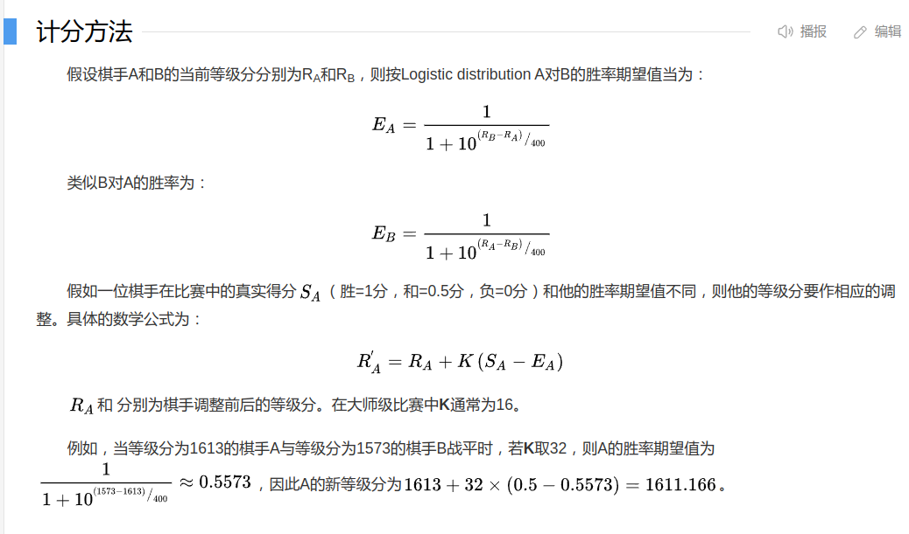

## Schedule and Results

**Date  比赛日期**

**Visitor/Neutral  客队名称（或中立场地的球队）**

**PTS (Visitor)  客队得分**

**Home/Neutral  主队名称（或中立场地的球队）**

**PTS (Home)  主队得分**

**Home/Neutral  主队名称（或中立场地的球队）**

**PTS (Home)  主队得分**

## Advanced Satas

Rk (Rank)  排名

Age  队员的平均年龄

**W (Wins)**  胜利次数

**L (Losses)**  失败次数

**PW (Pythagorean wins)**  基于毕达哥拉斯理论计算的赢的概率

**PL (Pythagorean losses)**  基于毕达哥拉斯理论计算的输的概率

ORtg (Offensive Rating)  每100个比赛回合中的进攻比例

DRtg (Defensive Rating)  每100个比赛回合中的防守比例

TOV% (Turnover Percentage)  每100场比赛中失误的比例

eFG% (Opponent Effective Field Goal Percentage)  对手投射命中比例

TOV% (Opponent Turnover Percentage)  对手的失误比例

**Rk,Team,Age,W,L,PW,PL**,MOV,SOS,SRS,**ORtg,DRtg**,NRtg,Pace,FTr,3PAr,TS%,,eFG%,**TOV%**,ORB%,FT/FGA,,**eFG%**,**TOV%**,DRB%,FT/FGA,,Arena,Attend.,Attend./G

## Bios Stats

**`TEAM_ABBREVIATION`**  **球队缩写（如 LAL=湖人）**

**`AGE`**  **球员年龄（以赛季开始时的年龄为准）**

**`PLAYER_HEIGHT`**  **身高（英尺-英寸格式，如 6'9"）**

**`PLAYER_WEIGHT`**  **体重（磅，如 250 磅≈113 公斤）**

|                    Abbreviation/ Acronym                     |                          Franchise                           |
| :----------------------------------------------------------: | :----------------------------------------------------------: |
|                             ATL                              | [Atlanta Hawks](https://en.wikipedia.org/wiki/Atlanta_Hawks) |
|                             BOS                              | [Boston Celtics](https://en.wikipedia.org/wiki/Boston_Celtics) |
|                             BKN                              | [Brooklyn Nets](https://en.wikipedia.org/wiki/Brooklyn_Nets) |
|                             CHA                              | [Charlotte Hornets](https://en.wikipedia.org/wiki/Charlotte_Hornets) |
|                             CHI                              | [Chicago Bulls](https://en.wikipedia.org/wiki/Chicago_Bulls) |
|                             CLE                              | [Cleveland Cavaliers](https://en.wikipedia.org/wiki/Cleveland_Cavaliers) |
|                             DAL                              | [Dallas Mavericks](https://en.wikipedia.org/wiki/Dallas_Mavericks) |
|                             DEN                              | [Denver Nuggets](https://en.wikipedia.org/wiki/Denver_Nuggets) |
|                             DET                              | [Detroit Pistons](https://en.wikipedia.org/wiki/Detroit_Pistons) |
| GSW GS[[a\]](https://en.wikipedia.org/wiki/Wikipedia:WikiProject_National_Basketball_Association/National_Basketball_Association_team_abbreviations#cite_note-ESPNABC-1) | [Golden State Warriors](https://en.wikipedia.org/wiki/Golden_State_Warriors) |
|                             HOU                              | [Houston Rockets](https://en.wikipedia.org/wiki/Houston_Rockets) |
|                             IND                              | [Indiana Pacers](https://en.wikipedia.org/wiki/Indiana_Pacers) |
|                             LAC                              | [Los Angeles Clippers](https://en.wikipedia.org/wiki/Los_Angeles_Clippers) |
|                             LAL                              | [Los Angeles Lakers](https://en.wikipedia.org/wiki/Los_Angeles_Lakers) |
|                             MEM                              | [Memphis Grizzlies](https://en.wikipedia.org/wiki/Memphis_Grizzlies) |
|                             MIA                              |    [Miami Heat](https://en.wikipedia.org/wiki/Miami_Heat)    |
|                             MIL                              | [Milwaukee Bucks](https://en.wikipedia.org/wiki/Milwaukee_Bucks) |
|                             MIN                              | [Minnesota Timberwolves](https://en.wikipedia.org/wiki/Minnesota_Timberwolves) |
| NOP NO[[a\]](https://en.wikipedia.org/wiki/Wikipedia:WikiProject_National_Basketball_Association/National_Basketball_Association_team_abbreviations#cite_note-ESPNABC-1) | [New Orleans Pelicans](https://en.wikipedia.org/wiki/New_Orleans_Pelicans) |
| NYK NY[[a\]](https://en.wikipedia.org/wiki/Wikipedia:WikiProject_National_Basketball_Association/National_Basketball_Association_team_abbreviations#cite_note-ESPNABC-1) | [New York Knicks](https://en.wikipedia.org/wiki/New_York_Knicks) |
|                             OKC                              | [Oklahoma City Thunder](https://en.wikipedia.org/wiki/Oklahoma_City_Thunder) |
|                             ORL                              | [Orlando Magic](https://en.wikipedia.org/wiki/Orlando_Magic) |
|                             PHI                              | [Philadelphia 76ers](https://en.wikipedia.org/wiki/Philadelphia_76ers) |
|                             PHX                              |  [Phoenix Suns](https://en.wikipedia.org/wiki/Phoenix_Suns)  |
|                             POR                              | [Portland Trail Blazers](https://en.wikipedia.org/wiki/Portland_Trail_Blazers) |
|                             SAC                              | [Sacramento Kings](https://en.wikipedia.org/wiki/Sacramento_Kings) |
| SAS SA[[a\]](https://en.wikipedia.org/wiki/Wikipedia:WikiProject_National_Basketball_Association/National_Basketball_Association_team_abbreviations#cite_note-ESPNABC-1) | [San Antonio Spurs](https://en.wikipedia.org/wiki/San_Antonio_Spurs) |
|                             TOR                              | [Toronto Raptors](https://en.wikipedia.org/wiki/Toronto_Raptors) |
| UTA UTAH[[a\]](https://en.wikipedia.org/wiki/Wikipedia:WikiProject_National_Basketball_Association/National_Basketball_Association_team_abbreviations#cite_note-ESPNABC-1) |     [Utah Jazz](https://en.wikipedia.org/wiki/Utah_Jazz)     |
|                             WAS                              | [Washington Wizards](https://en.wikipedia.org/wiki/Washington_Wizards) |

我想要对今年NBA赛季的胜负情况进行预测，这个问题本质上是一个分类问题，即主队是否获胜，我的方案是：使用历史数据中的某些稳定的特征（elo、胜率） + 当前赛季中一些动态变化的特征 来预测当场比赛主队是否获胜

我现在能获得的数据集：上一个赛季的各个球队的每场比赛信息schedule、上一个赛季各个队伍的整体数据stats，包括胜率、失误率等

我本来想用stats和schedule来训练模型，包括构造两个队伍的胜率之差，失误率之差（stats中获得），两个队伍上一场比赛的各自输赢情况，上一场比赛距离时间之差（schedule中获得），但是我发现这么做会有一个问题：stats的数据本来就是从schedule中统计得到的，这并不是我想获得的“历史数据”，这么训练没有意义。

我现在有另一个方案：我使用上一个赛季的schedult数据来实现

---

### 构造特征

特征分为两个方面：队伍实力 + 心理因素，特征数据的来源也分为两个方面：历史数据（前1个赛季的数据）+ 当前赛季的累积数据（即当前要预测的比赛之前的统计信息）

#### 队伍实力

1. ==**当前赛季的累计elo**==：elo能衡量队伍的真实实力，因为它考虑到胜率中队伍相对强弱的因素：队伍战胜弱队 和 队伍战胜强队 虽然在计算胜率时是等价的，但是在elo中考虑到这一点：队伍战胜强队 比 队伍战胜弱队 更能说明该队伍的实力强，elo等级分不会简单地考虑到胜率
2. ==**当前赛季的球员生物特征**==：包括平均年龄、平均BMI指数
3. **上个赛季的两个队伍相对排名**
4. ==**当前赛季中明星球员的BMP**==：这将实力的衡量放在了球员的粒度上。这是NBA球赛的不确定性导致的：因为人员的流动会导致队伍的实力有较大的变化，所以将实力的衡量放在球员的粒度上是比较合理的

---

1. **当前赛季中队伍的负伤情况**
2. **上个赛季中两个队伍体现出来的攻防能力**：使用ORtg和DRtg（百回合中的进攻比例 和 防守比例）综合起来考虑两个队伍的攻防能力

#### 心理因素

1. **是否有连胜/连负情况**
2. **上次比赛的输赢情况**
3. **上次两队交锋的情况**
4. ==**距离上次比赛的天数**==

route:
  rules:
    - type: field
      domain_suffix:
        - "openai.com"
        - "pay.openai.com"
        - "chat.openai.com"
        - "challenges.cloudflare.com"
        - "auth0.openai.com"
        - "platform.openai.com"
        - "ai.com"
        - "invoice.stripe.com"
        - "stripe.com"
      outbound: "proxy"  # 代理出站名称
    - type: field  # 默认直连其他流量
      outbound: "direct"
      network: "tcp,udp"

### 等级分

---

**Date**,Start (ET),**Visitor/Neutral,PTS,Home/Neutral,PTS**,,,Attend.,LOG,Arena,Notes

PLAYER_ID,PLAYER_NAME,TEAM_ID,**TEAM_ABBREVIATION,AGE**,PLAYER_HEIGHT,**PLAYER_HEIGHT_INCHES**,**PLAYER_WEIGHT**,COLLEGE,COUNTRY,DRAFT_YEAR,DRAFT_ROUND,DRAFT_NUMBER,GP,PTS,REB,AST,NET_RATING,OREB_PCT,DREB_PCT,USG_PCT,TS_PCT,AST_PCT

Rk,Team,Age,W,L,PW,PL,MOV,SOS,SRS,ORtg,DRtg,NRtg,Pace,FTr,3PAr,TS%,,eFG%,TOV%,ORB%,FT/FGA,,eFG%,TOV%,DRB%,FT/FGA,,Arena,Attend.,Attend./G

date,visitor,v_pts,home,h_pts,home_win
Tue Oct 22 2024,New York Knicks,109,Boston Celtics,132,1
Tue Oct 22 2024,Minnesota Timberwolves,103,Los Angeles Lakers,110,1
Wed Oct 23 2024,Indiana Pacers,115,Detroit Pistons,109,0
Wed Oct 23 2024,Brooklyn Nets,116,Atlanta Hawks,120,1

