# 音乐推荐算法优化

## 数据集介绍

- user_artist_data.txt：2420万条用户播放艺术家歌曲次数、

  格式：用户ID 艺术家ID 播放次数

  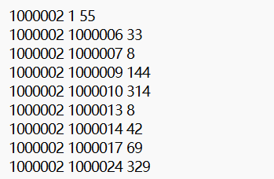

- artist_data.txt：160万个艺术家的ID和名字

  格式：艺术家ID 艺术家名字

  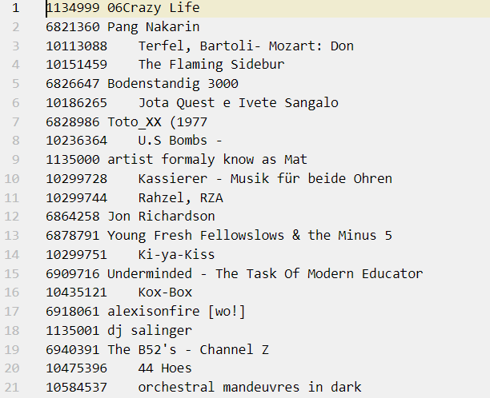

- artist_alias.txt：19万条 拼写错误的艺术家ID到该艺术家规范ID的映射

  格式：拼写错误的艺术家ID  艺术家正确ID

  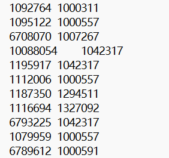

## 预处理

1. 找出artist_data.txt和artist_alias.txt:文件中数据不规范的类型，分别统计不同类型的记录数量，例如缺少艺术家ID：100条
2. 根据artist_alias.txt的映射关系，将user_artist_data.txt进行更新

### 统计不合法情况

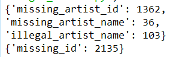

artist_data.txt：**missing_artist_id, missing_artist_name, illegal_artist_name**

artist_alias.txt：**missing_id**

### 转换为CSV格式

首先将txt文件转换为CSV文件，方便后续操作

- user_artist_data.txt：用户ID 艺术家ID 播放次数，**user_id, artist_id, count**
- artist_data.txt：艺术家ID 艺术家名字，**artist_id，artist_name**
- artist_alias.txt：拼写错误的艺术家ID  艺术家正确ID，**wrong_id，right_id**

转换问题：

1. artist_data.txt有很多乱码name，需要将它们替换为`?`
2. artist_data.txt中需要指定以第一个缩进符作为分隔符，艺术家的名字中也有缩进符
3. user_artist_data.txt中包含了一些错误行，只有一个或两个值的行

user_artist_data，共24296858行；artist_data，共1848707行；

筛选后，user_artist_data.csv共24296858行；artist_data共1848557行

## 统计

统计播放量最高的30名艺术家ID及其被播放总次数

- 按照播放次数降序输出
- 显示格式：序号、艺术家名字、总播放次数

UV分解

1. 基于讲义中UV分解方法编码实现算法，画出每次迭代的误差平方和曲线
2. 采用梯度下降法提高上述UV分解方法效率，从程序收敛速度和误差曲线下降趋势对比讲义中的方法

讲义中的UV分解是Funk-SVD方法，相较于**特征值分解**（只能适用于方阵）和**奇异值分解**（需要原始矩阵是稠密的，且计算复杂度很高），**Funk-SVD**能适用于稀疏矩阵，且计算复杂度低于奇异值分解，是推荐系统中常用的矩阵分解方法

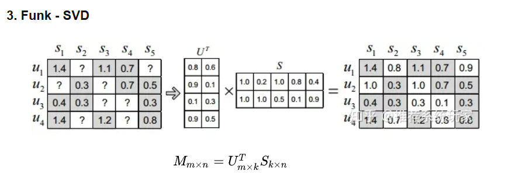

Funk-SVD：将矩阵分解为两个矩阵，分解的目标是**让分解后的两个矩阵乘积得到的评分矩阵和原始矩阵更拟合，即与原始矩阵的残差最小**

原始矩阵 项$r$的近似值$\hat r = q_{j}^{T}p_{i}$，那么分解的目标是让$r-\hat r = (r_{i,j}-p{j}^{T}q_{i})$尽可能小，损失函数为：

函数：
$$
Loss = argmin\sum_{i,j}({r_{i,j}-q_{j}^{T}p_{i}}) ^2
$$
为了防止过拟合，加入正则化项：
$$
Loss = argmin\sum_{i,j}({r_{i,j}-q_{j}^{T}p_{i}})^2 +(\left|\left| p_{i}\right|\right|+\left|\left| q_{j}\right|\right|) ^2
$$
矩阵分解的方法有三种（特征值分解、奇异值分解、Funk-SVD)，而求分解结果的方法，即矩阵求解 可以使用梯度下降法，最小二乘法。课件中使用的是**交替最小二乘法**，更加高效和常用的方法是**梯度下降法**。实验要求先使用课件中的**交替最小二乘法**，然后优化为**梯度下降法**，比较算法的运行效率，评估优化程度

### ALS（交替最小二乘法）

$M$被分解为$UV$，固定物品矩阵$V$，通过最小化误差平方和来更新用户矩阵$U$，然后固定用户矩阵$U$，更新物品矩阵$V$....交替迭代，直至收敛

每一次迭代的过程：

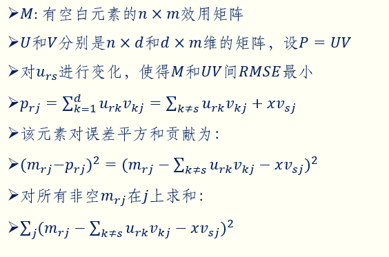

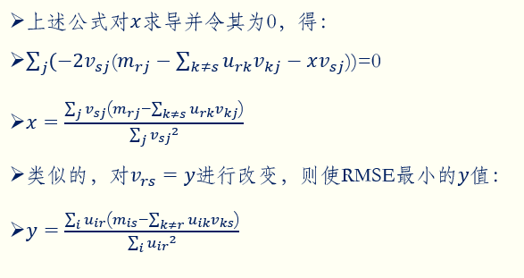

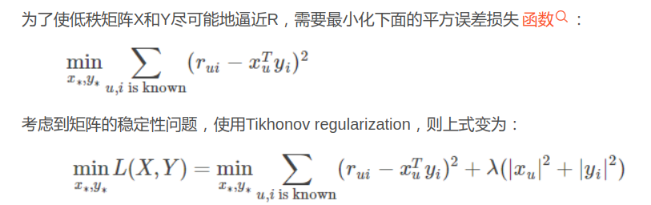

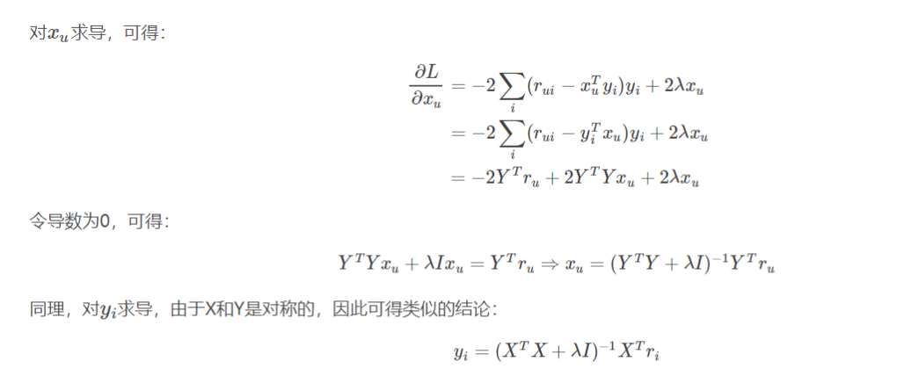

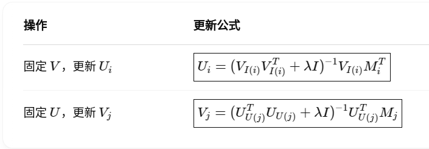

[推荐系统玩家 之 矩阵分解(Matrix Factorization)的基本方法 及其 优缺点](https://www.zhihu.com/tardis/zm/art/145120275?source_id=1005)

[协同过滤(ALS)的原理及Python实现 - 知乎](https://zhuanlan.zhihu.com/p/47584486)

[als.py](https://github.com/tushushu/imylu/blob/master/imylu/recommend/als.py)

[als_example.py](https://github.com/tushushu/imylu/blob/master/examples/als_example.py)

[练习题︱ python 协同过滤ALS模型实现：商品推荐 + 用户人群放大_python实现als协同过滤-CSDN博客](https://blog.csdn.net/sinat_26917383/article/details/106542667)
$$
u_{rs} = \frac{\sum_{j}v_{sj}(m_{rj}-\sum_{k≠s}u_{rk}v_{kj})}{\sum_{j}v_{sj}^2}
$$

### 梯度下降

#### 简述梯度下降

目标：给函数找最小值，这里是给误差函数寻找最小值。梯度的负方向下降地最快，类似于下坡，为了下坡最快，需要沿着坡梯度的负方向走，新位置 = 现在位置 - 步长 * 梯度，其中步长就是学习率，学习率太大或太小都不好，太大会导致震荡，跳过最优解甚至发散，太小会导致收敛速度非常慢

梯度下降的简单实现：

```python
import numpy as np
import matplotlib.pyplot as plt
def f(x):
    return np.power(x, 2)
def d_f_1(x):
    return 2.0 * x
def d_f_2(f, x, delta=1e-4):
    return (f(x+delta) - f(x-delta)) / (2 * delta)
# plot the function
xs = np.arange(-10, 11)
plt.plot(xs, f(xs))
plt.show()
learning_rate = 0.1
max_loop = 30
x_init = 10.0
x = x_init
lr = 0.1
for i in range(max_loop):
    # d_f_x = d_f_1(x)
    d_f_x = d_f_2(f, x)
    x = x - learning_rate * d_f_x
    print(x)
print('initial x =', x_init)
print('arg min f(x) of x =', x)
print('f(x) =', f(x))
```

- **`d_f_1(x)`**：这是目标函数 $f(x)$ 的解析导数（即梯度）。对于 $f(x) = x^2$，它的导数是 $2x$，所以 `d_f_1(x)` 返回的是 $2x$。
- **`d_f_2(f, x, delta=1e-4)`**：这是一个通过数值差分方法（有限差分法）计算梯度的函数。它使用一个小的增量 `delta` 来近似计算目标函数在某点 $x$ 的导数。其通过计算 $\frac{f(x+\delta) - f(x-\delta)}{2\delta}$ 来估算导数，适用于没有解析导数的情况。

**梯度下降的过程**

`learning_rate = 0.1`：学习率，决定每次更新时步长的大小。

`max_loop = 30`：最大迭代次数，限制了梯度下降法的迭代次数，防止程序运行时间过长。

`x_init = 10.0`：初始化 $x$ 的值，开始时 $x = 10.0$。

通过迭代，每次根据梯度来更新 $x$ 的值：
$$
x = x - \text{learning\_rate} \times \text{d\_f\_x}
$$
即每次更新 $x$ 时，按照梯度的负方向进行调整，从而逐步逼近函数的最小值

#### 梯度下降在矩阵分解中的应用

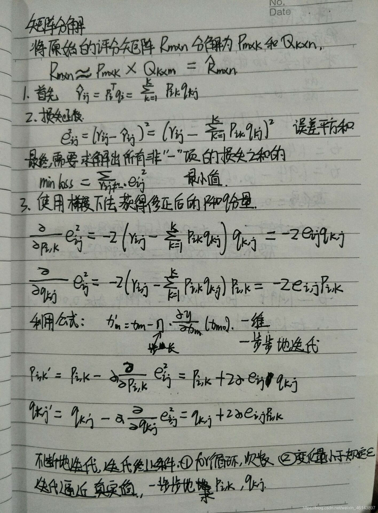

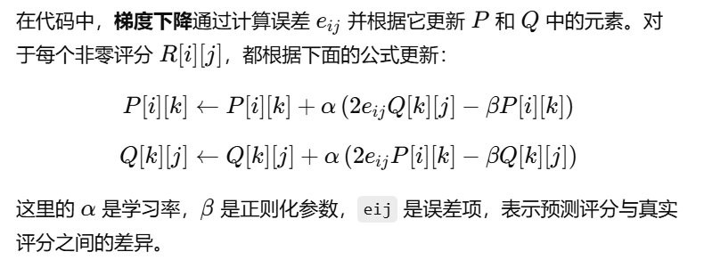

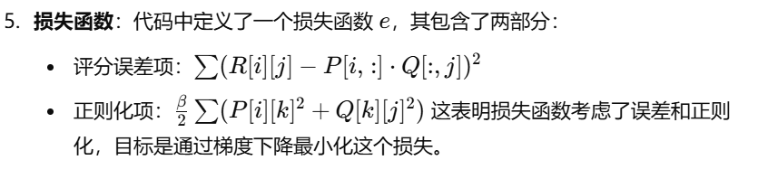

Python实现：

```Python
# encoding: utf-8
__author__ = 'Scarlett'
#矩阵分解在打分预估系统中得到了成熟的发展和应用
# from pylab import *
import matplotlib.pyplot as plt
from math import pow
import numpy


def matrix_factorization(R,P,Q,K,steps=5000,alpha=0.0002,beta=0.02):
    Q=Q.T  # .T操作表示矩阵的转置
    result=[]
    for step in range(steps):
        for i in range(len(R)):
            for j in range(len(R[i])):
                if R[i][j]>0:
                    eij=R[i][j]-numpy.dot(P[i,:],Q[:,j]) # .dot(P,Q) 表示矩阵内积
                    for k in range(K):
                        P[i][k]=P[i][k]+alpha*(2*eij*Q[k][j]-beta*P[i][k])
                        Q[k][j]=Q[k][j]+alpha*(2*eij*P[i][k]-beta*Q[k][j])
        eR=numpy.dot(P,Q)
        e=0
        for i in range(len(R)):
            for j in range(len(R[i])):
                if R[i][j]>0:
                    e=e+pow(R[i][j]-numpy.dot(P[i,:],Q[:,j]),2)
                    for k in range(K):
                        e=e+(beta/2)*(pow(P[i][k],2)+pow(Q[k][j],2))
        result.append(e)
        if e<0.001:
            break
    return P,Q.T,result

if __name__ == '__main__':
    R=[
        [5,3,0,1],
        [4,0,0,1],
        [1,1,0,5],
        [1,0,0,4],
        [0,1,5,4]
    ]

    R=numpy.array(R)

    N=len(R)
    M=len(R[0])
    K=2

    P=numpy.random.rand(N,K) #随机生成一个 N行 K列的矩阵
    Q=numpy.random.rand(M,K) #随机生成一个 M行 K列的矩阵

    nP,nQ,result=matrix_factorization(R,P,Q,K)
    print("原始的评分矩阵R为：\n",R)
    R_MF=numpy.dot(nP,nQ.T)
    print("经过MF算法填充0处评分值后的评分矩阵R_MF为：\n",R_MF)

#-------------损失函数的收敛曲线图---------------

    n=len(result)
    x=range(n)
    plt.plot(x,result,color='r',linewidth=3)
    plt.title("Convergence curve")
    plt.xlabel("generation")
    plt.ylabel("loss")
    plt.show()
```

```python
def gradient_descent(U, V, M, max_iter=20, lambda_reg=0.1, eta=0.01, tolerance=1e-3):
    errors = []
    
    for current_iter in range(max_iter):
        print(current_iter)
        total_error = 0
        
        # 梯度下降：更新U
        for r in range(U.shape[0]):
            row = M.getrow(r)  # 获得M的第r行的行向量
            for j, m_rj in zip(row.indices, row.data):
                prediction = np.dot(U[r, :], V[:, j])
                error = m_rj - prediction
                total_error += error ** 2
                
                # 更新U[r, :] - 梯度下降
                for k in range(U.shape[1]):
                    U[r, k] += eta * (2 * error * V[k, j] - lambda_reg * U[r, k])
        
        # 梯度下降：更新V
        for s in range(V.shape[1]):
            col = M.getcol(s)  # 获得M的第s列的列向量
            for r, m_is in zip(col.indices, col.data):
                prediction = np.dot(U[r, :], V[:, s])
                error = m_is - prediction
                total_error += error ** 2
                
                # 更新V[:, s] - 梯度下降
                for k in range(V.shape[0]):
                    V[k, s] += eta * (2 * error * U[r, k] - lambda_reg * V[k, s])
        
        errors.append(total_error)
        
        # 如果误差变化很小，则提前停止
        if current_iter >= 2 and abs(errors[-1] - errors[-2]) < tolerance:
            break
        
    # 绘制误差曲线
    plt.plot(range(1, max_iter+1), errors)
    plt.xlabel('Iteration')
    plt.ylabel('Squared Error')
    plt.title('Error vs. Iteration')
    plt.xticks(range(1, max_iter+1, 2))
    plt.show()
    
    return U @ V, errors
```

## 实验结果

原数据集中，每人平均听过的艺术家个数：

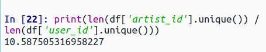

ALS：

- 迭代次数：20
- 样本大小：抽取20%的艺术家，样本共有236, 0126个，总样本数的10%左右

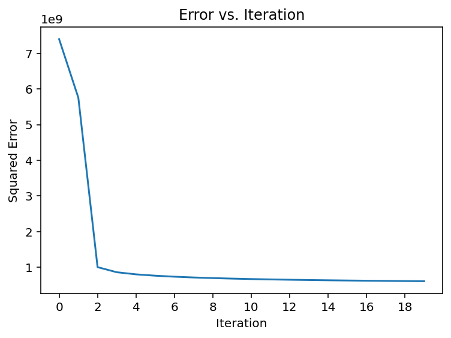

- 样本大小：原样本，无抽取

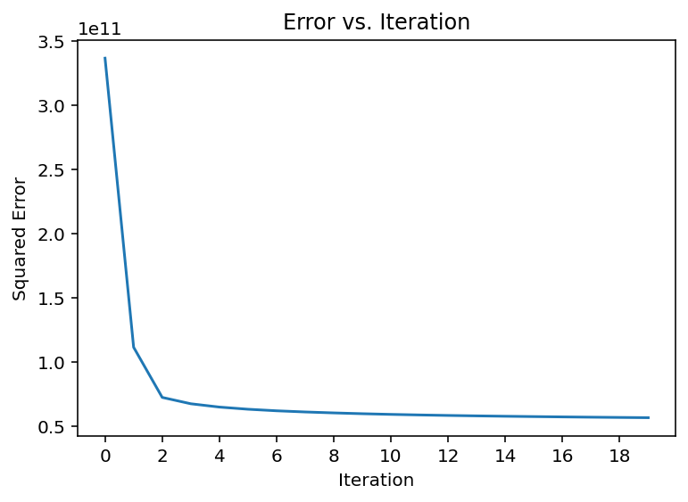

收敛速度非常快，**前两次迭代**误差下降得非常快，从第3次迭代就已经接近收敛。这是因为ALS每轮迭代都是精确最优解（闭式解），即 **每一次对 U 或 V 的更新，都是“在当前固定另一边情况下的最优解”，不是一步步试出来的，而是一次就算出最优**。目标函数是一个二次凸函数，每轮迭代都会精确地逼近局部极小点，下降路径是稳定的

梯度下降：

- 学习率：1e-3
- 正则化参数：0.1
- 迭代次数：30
- 训练时间：2h（11:55~14:00）

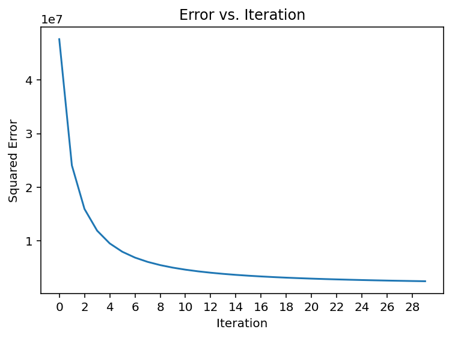

---

没有对效用矩阵归一化，初始矩阵U、V设置为全1的，效果不是很好：

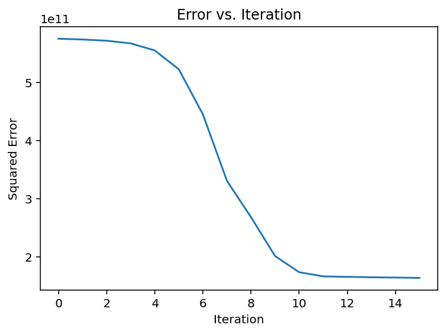


